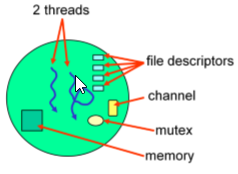
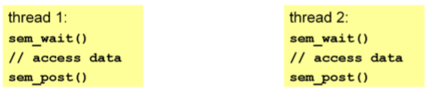
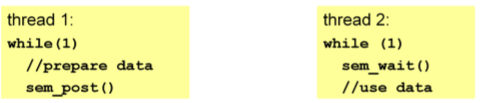

# QNX Process&Thread

## Process
进程是所有线程的集合,并对其资源进行管理和调度.
* 进程包含数据和代码及其他拥有的资源
* 进程至少拥有一个线程



### Creation

#### fork()
创建一个进程的拷贝.
* 与父进程完全相同数据及属性
 * fds文件描述符
 * 线程的属性
 * uid,gid,umask,process group,session
 * address space is replicated
* QNX不支持在多线程的进程里使用fork
* fork在父进程里返回子进程的pid, 在子进程执行fork里返回的pid=0


#### exec*()
替换当前的进程
*pid不变
*创建新的地址空间address space
*可以传入参数变量
*不会返回一直阻塞直到错误

#### spawn(),spawn*()
创建一个新进程
* 避免拷贝数据段
* 避免大量的立即会被取消的创建和初始化操作
* 较少的调用
* 支持在多线程的进程里操作

### Termination
#### POSIX behaviour
* 当子进程die时,父进程会收到信号`SIGCHLD`, 该信号不会结束进程
* 父进程可以调用wait等方法获得子进程die的原因

#### client/server
* server端会获得任一client端die的通知
* client端会获得其server端die的通知
* 前提是client和server的连接已建立

### Sample
```c
// spawn_example.c
#include <stdio.h>
#include <unistd.h>
#include <stdlib.h>
#include <signal.h>

int main(int argc, char **argv)
{
	int pid;
	int status;
	sigset_t set;

	// create a new child process
	pid = spawnl(P_NOWAIT, "/usr/bin/sleep", "sleep", "30", NULL );
	if (-1 == pid)
	{
		perror("spawnl()");
		exit(EXIT_FAILURE);
	}

	printf("child pid is %d\n", pid);
	printf("View the process list in the IDE or at the command line.\n");
	printf("In the IDE Target Navigator menu try group->by PID family\n");
	printf("With pidin, try 'pidin family' to get parent/child information.\n");

	// initial sigset  data struct
	if (-1 == sigemptyset(&set))
	{
		perror("sigemptyset");
		exit(EXIT_FAILURE);
	}

	// add interesting signal in set
	if (-1 == sigaddset(&set, SIGCHLD ))
	{
		perror("sigaddset");
		exit(EXIT_FAILURE);
	}

	// block here to wait a interesting signal
	if (-1 == sigwaitinfo(&set, NULL )) // block until a SIGCHLD hits, that is, until the child process dies
	{
		perror("sigwaitinfo");
		exit(EXIT_FAILURE);
	}

	printf("Child has died, pidin should now show it as a zombie\n");
	sleep(30);

	// wait for child process terminated
	pid = wait(&status); // get the status of the dead child, and
	if (-1 == pid)
	{
		perror("wait");
		exit(EXIT_FAILURE);
	}
	printf("child process: %d, died with status %x\n", pid, status);
	printf("Zombie is now gone as we've waited on the child process.\n");
	sleep(30);

	return 0;
}
```

## Thread

### Creation
线程的创建如下:
```c
pthread_create(pthread_t *tid,pthread_attr *attr,void *(*func)(void *),void *arg);
```
设置线程属性
```c
pthread_attr_t attr;
pthread_attr_init(&attr);

pthread_attr_setdetachstate()
pthread_attr_setinheritsched()
pthread_attr_setschedparam()
pthread_attr_setschedpolicy()
pthread_attr_setstackaddr()
pthread_attr_setstacksize()

```

### Operations

* pthread_exit(retval) 退出线程
* pthread_join(tid,&retval) 等待一个线程直到die或返回
* pthread_kill(tid,signo) 在线程上设置一个信号
* pthread_cancel(tid) 取消一个线程,请求线程终止
* pthread_detach(tid) 使线程detached/unjoinable
* pthread_self() 返回线程id

### Synchronization

#### mutexes  互斥锁

* 在同一时间,重要区域的代码只允许一个线程进入
* 在同一时间,特定数据只允许一个线程访问

##### 互斥锁的初始化与销毁

```c
pthread_mutex_init(pthread_mutex_t *,pthread_mutexattr_t *);
pthread_mutex_destory(pthread_mutex_t *);
```

##### 互斥锁的使用

```c
pthread_mutex_lock(pthread_mutex_t *);
pthread_mutex_trylock(pthread_mutex_t *);
pthread_mutex_unlock(pthread_mutex_t *);
```

##### 互斥锁使用注意点

* 防止死锁 确保所有的线程在获取互斥锁的是有序的
* 低优先级的线程A在获取到互斥锁后,若遇到高优先级的线程B也请求该互斥锁,那么拥有互斥锁的线程的优先级会临时调高到和线程B一样的优先级, A在释放互斥锁后,恢复原先的优先级
* 尽量使得持有互斥锁在很短的间隔

##### Sample

 * [nomutex](../code/qnxprocessthread/src/nomutex.c)
 * [mutex_sync](../code/qnxprocessthread/src/mutex_sync.c)

#### Condition
条件变量(condvar), 一个线程等待一个条件满足才继续执行,否则一直等待.


##### Condvar的使用

```c
pthread_cond_init(pthread_cond_t *,pthread_condattr_t *);
pthread_cond_wait(pthread_cond_t *,pthread_mutex_t *);
pthread_cond_signal(pthread_cond_t *);
pthread_cond_broadcast(pthread_cond_t *);
```

##### Sample

 * [condvar](../code/qnxprocessthread/src/condvar.c)
 * [producer_consumer_example](../code/qnxprocessthread/src/producer_consumer_example.c)


#### semaphores 信号量

##### 初始化及销毁
```c
// unnamed 
sem_init(sem_t *semaphore,int pshared,unsigned int val);
sem_destory(sem_t *semaphore);

// named
sem_t *sem_open(char* name,int oflag,[int sharing,unsigned int val]);
sem_close(sem_t *semaphore);
sem_unlink(char *name);

```

##### 使用及场景
```c
sem_post(sem_t *semaphore);
sem_trywait(sem_t *semaphore);
sem_wait(sem_t *semaphore); // 检查count value是否大于0, 若大于0则减1后,立即成功返回,否则阻塞等待
sem_getvalue(sem_t *semaphore,int *value); // 使count value 加1, 可能会唤醒一个等待的线程
```

* unamed信号量比named信号量快(sem_post/sem_wait)
* unamed信号量在多线程情况下易于使用

信号量有两种使用场景:

* 需要打破互斥



* 分发机制



##### Sample
* [semaphore_example](../code/qnxprocessthread/src/semaphore_example.c)

#### atomic operation

原子操作
```c
atomic_add
atomic_add_value
atomic_clr
atomic_clr_value
atomic_set
atomic_set_value
atomic_sub
atomic_sub_value
atomic_toggle
atomic_toggle_value
```