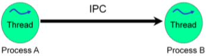
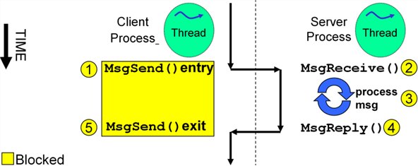
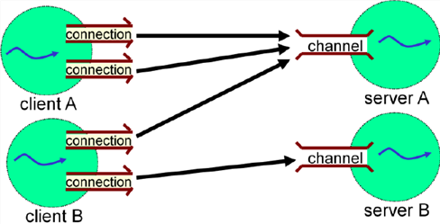
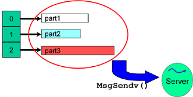

# QNX IPC
Inter-Process Communication 内部进程通讯,可以交换 1) 数据 2) 控制 3) 事件通知



QNX Neutrino支持如下类型的IPC:

* QNX Core
  * messaging 消息
  * pulses 脉冲
  * shared memory
  * PPS 持久化的发布和订阅
* POSIX/Unix
  * signals 信号
  * shared memory
  * pipes 管道
  * POSIX message queus
  * TCP/IP sockets

## Message Passing

QNX Native IPC 是类似远程调用(RPC)的架构,完全同步机制

* 基于c/s客户端和服务端的请求应答机制
* 双向通讯

### Basic

#### 流程和状态
`MsgSend()` : 发送消息,一般是client调用发送消息给server, 此刻发送方所在线程处于阻塞状态,直至收到reply
`MsgReceive()`: 接收消息, 一般是server端调用,等待接收client发送的消息, 此刻接收方所在线程处于阻塞状态, 直至收到消息
`MsgReply()`: 回复发送的消息, 一般是接收方,收到消息后,需要回复应答,告知发送方



#### 通道&连接
* Channel
 * 服务端通道
 * 主要针对server, server会在这个channel上监听等待client连接
 * 一个server对应一个channel
* Connection
 * 客户端连接
 * 主要针对client, 连接到server上对应的channel
 * 一个client可以有很多connection到server的channel

NOTE: 这里channel和connection的概念可以类比socket编程中的socket server需要在本地监听一个port等待服务, socket client则主动发起连接到socket server监听的port, 连接建立后就可以发送/接收消息



简单来说, channel是server端的范畴(channel id由server端产生), connection是client端的范畴(connection id由client端产生)

#### 流程

Server端的步骤:

1. 创建一个channel
2. 等待接收消息
3. 回复消息
4. 继续步骤2

Client端的步骤:

1. 连接到server端的channel
2. 发送消息
3. 等待回复消息
4. 处理其它逻辑

### API

#### Server

```c
int chid = ChannelCreate(flags);
```
创建server通道, `flags` 通道参数, 返回chid, client端连接需要用到 channel id


```c
int rcvid = MsgReceive(chid,rmsg,rbytes_size,info);
```
在建好的通道上,等待接收消息,当收到消息后,返回rcvid

* chid: server上建立的通道id
* rmsg: 存放接收到的消息
* rbytes_size: 接收到的消息的字节长度
* info: 存放本次通讯的额外信息
* rcvid: 本次接收的讯息的标识, 在回复时`MsgReply()`需要用到

```c
MsgReply(rcvid,status,msg,bytes_size);
```
应答发送方,回复状态和消息

* rcvid: 
* status: 本次通讯的状态,对应`MsgSend()` 返回的值
* msg: 应答的消息
* bytes_size: 应答的消息的字节长度

```c
MsgError(rcvid,error)
```
应答发送方本次通讯状态为错误, 对应`MsgSend()`的返回值为-1

#### Client

```c
int coid = ConnectAttach(nd,pid,chid,_NTO_SIDE_CHANNEL,flags);
```
建立到server上channel的连接,返回coid, connection id

* nd: node descriptor 代表server运行的节点,一般是电脑 `ND_LOCAL_NODE`或0 表示本机
* pid: server的进程号 
* chid: server上建立的通道id


```c
int status = MsgSend(coid,smsg,sbytes_size,rmsg,rbytes_size);
```
在建立好的连接上发送消息,然后等待到reply后,返回发送状态status

* coid: connection id
* smsg: 需要发送的消息数据
* sbytes_size: 发送数据的字节长度
* rmsg: 存放稍后回复的消息
* rbytes_size: 回复的消息的字节长度
* status: 该返回值是`MsgReply()`里设置的参数值

### Sample

* [sample1_msg_client.c](../code/qnxipc/sample1_msg_client.c)
* [sample1_msg_server.c](../code/qnxipc/sample1_msg_server.c)

## Pulses

脉冲特性:

* 不会阻塞发送方线程
* 固定大小的payload  
 * value:4byte 
 * code:1byte (-128~127) 
  * 负值预留给系统脉冲使用
  * 应用可以使用的范围 0~127
* 不是双向的即不需要回复
* 快且开销小

```c
MsgSendPulse(coid,priority,code,value);
```

接收脉冲pulse同样使用`MsgReceive()`,通过返回值rcvid来判断是否是pulse还是普通message

* rcvid==0 : pulse 
* rcvid>0: message
* rcvid==-1: receive buffer is not enough or any other failure happen

其中pulse的数据结构定义在`<sys/neutrino.h>` 中`_pulse`; 类似如下
```c
struct _pulse{
 signed char code;
 union sigval value;
 int scoid;
}
```

Sample

* [sample2_pulse_client.c](../code/qnxipc/sample2_pulse_client.c)
* [sample2_pulse_server.c](../code/qnxipc/sample2_pulse_server.c)

## name_attach() name_open()

通过server运行后产生的进程id(pid)和通道id(cid),再在client端进行connection的建立,显然是不方便的.
QNX提供通过绑定到 path name的方式使得client和server双方逻辑上解耦,只需要知道这个path name.

### server

```c
name_attach_t *attach;
attach = name_attach(NULL,"my_path_name",0);
rcvid = MsgReceive(attach->chid,&msg,sizeof(msg),NULL);

name_detach(attach,0);
```

`name_attach()`会在内部调用`ChannelCreate()`,并设置channel的flags参数如下:

* _NTO_CHF_DISCONNECT 当任一个client下线断开时kernel会发送pulse给server
* _NTO_CHF_COID_DISCONNECT 当server断开时kernel会发送pulse给client
* _NTO_CHF_UNBLOCK

### client

```c
coid = name_open("my_path_name",0);

MsgSend(coid,&msg,sizeof(msg),NULL,0);

name_close(coid);
```

### Sample

* [sample3_namelookup_client.c](../code/qnxipc/sample3_namelookup_client.c)
* [sample3_namelookup_server.c](../code/qnxipc/sample3_namelookup_server.c)

## Server Cleanup

### Disconnect
当客户端断开连接时,server端需要及时做一些清理工作,释放已断开连接client的相关数据

一般是在客户端断开时,服务端会收到pulse(code=_PULSE_CODE_DISCONNECT)
```c
ConnectDetach(pulse.scoid)
```
Sample

* [sample4_disconnect_client.c](../code/qnxipc/sample4_disconnect_client.c)
* [sample4_disconnect_server.c](../code/qnxipc/sample4_disconnect_server.c)

### Unblock
当client在发送消息后(MsgSend())后会处于阻塞状态,直至收到server端的reply.

若client在未收到reply处于阻塞状态时, 此时client收到中断信号等(ctr+c), kernel将延后处理中断信号, 同时发送pulse到server告知`_PULSE_CODE_UNBLOCK`及被中断的client信息

sample

* [sample5_unblock_client.c](../code/qnxipc/sample5_unblock_client.c)
* [sample5_unblock_server.c](../code/qnxipc/sample5_unblock_server.c)

## Multi-Part Messages

当要一次发送多个消息的时候, 可以将多个消息合并成一个完整的新消息,然后再发送. 其中势必会进行申请空间(`malloc()`)和复制(`memcpy()`)操作

 => 

也可以用指针数组的形式关联多个消息, 避免了`malloc()`和`memcpy()`



### IOVs

`iov_t`定义如下:

```c
typedef struct{
  void *iov_base;
  size_t iov_len;
} iov_t;
```

```c
MsgSendv(int coid,iov_t *siov, int sparts,iov_t *riov,int rparts);

MsgSendvs(int coid,iov_t *siov,int sparts,void *rmsg,int rbytes);

MsgSendsv(int coid,void *smsg,int sbytes,iov_t *riov,int rparts);
```
一般使用IOV时,会以数组的形式使用,且数组的长度 Len = 消息个数 n + 1, 数组第一个元素存放header.

`header`通常包含消息类型type和消息总字节数size, 且`header`自身的字节数也固定.

```c
iov_t iovs[2]
header.nbytes = size;
SETIOV(&iovs[0], &header,sizeof(header));
SETIOV(&iovs[1], buf,size);
MsgSendv(coid,iovs,2,NULL,0);
```


### Sample

* [sample6_iov_client.c](../code/qnxipc/sample6_iov_client.c)
* [sample6_iov_server.c](../code/qnxipc/sample6_iov_server.c)

## Event

事件是通知的一种形式, 可以线程到线程, kernel到线程
组成形式有如下几种:
* pulse
* signals
* unblock an `InterruptWait()`

数据结构 `sigevent`

初始化方法如下:

```c
SIGEV_INTER_INIT(&event);

SIGEV_PULSE_INIT(&event,...);

SIGEV_SIGNAL_INIT(&event,...);

```

```c
// server
int chid = ChannelCreate(0);

// client
int coid = ConnectAttach(0,0,chid,_NTO_SIDE_CHANNEL, flags);

SIGEV_PULSE_INIT(&sigevent, coid, priority, code,value);
```

Sample

* [sample7_event_client.c](../code/qnxipc/sample7_event_client.c)
* [sample7_event_server.c](../code/qnxipc/sample7_event_server.c)

## Shared Memory

共享内存, 可以理解为创建了一个共享文件,多个进程都可以访问该共享文件, 只不过该文件存在内存里.

### 建立共享内存

1. 打开一个虚拟path获得文件描述符句柄  `fd = shm_open("/myname",O_RDWR_|O_CREAT,0666)`
2. 申请分配内存大小 `ftruncate(fd,SHARED_SIZE)`
3. 映射共享内存获得引用 `ptr = mmap(NULL,SHARED_SIZE,PROT_READ|PROT_WRITE,MAP_SHARED,fd,0)`
4. 关闭fd `close(fd)`

### 访问共享内存

1. 打开一个设置好的path获得文件描述符句柄 `fd = shm_open("/myname",O_RDWR_,0666)`
2. 映射共享内存获得引用 `ptr = mmap(NULL,SHARED_SIZE,PROT_READ|PROT_WRITE,MAP_SHARED,fd,0)`
3. 关闭fd `close(fd)`

### 释放共享内存

* 显式的释放

```c
close(fd);
munmap(ptr,SHARED_SIZE);
```
* 进程终止

* `shm_unlink("/myname")`

* 开发阶段

```shell
rm /dev/shmem/myname
```

### Sample

* [sample8_shmem_creator.c](../code/qnxipc/sample8_shmem_creator.c)
* [sample8_shmem_user.c](../code/qnxipc/sample8_shmem_user.c)