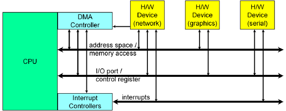
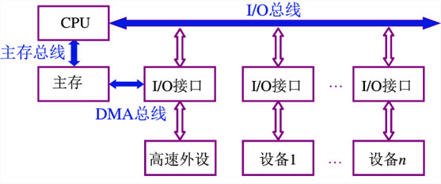
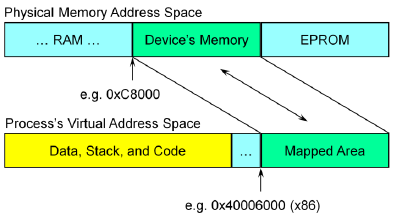
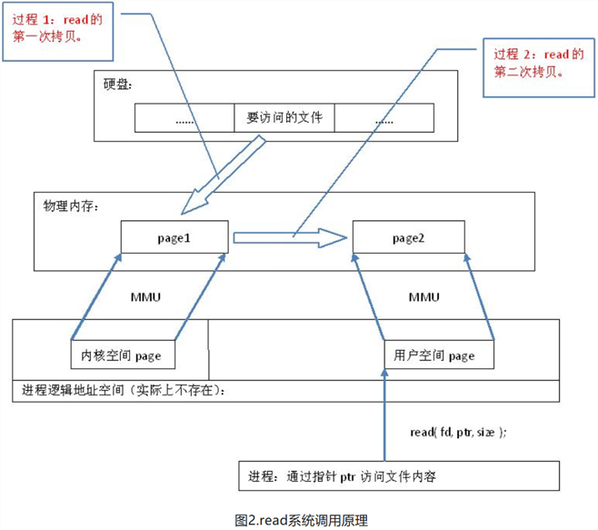
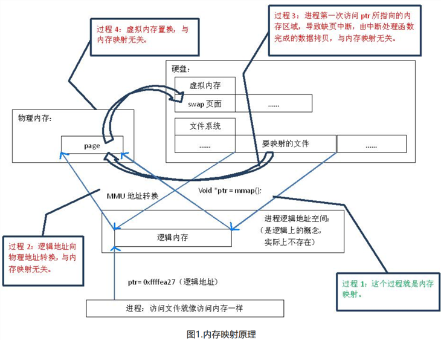
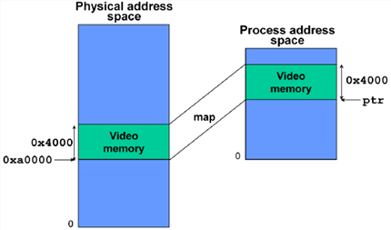
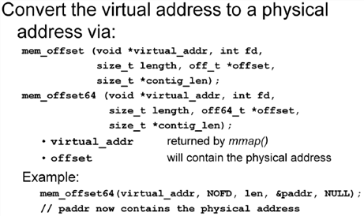
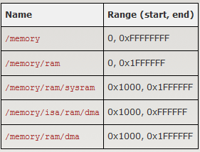
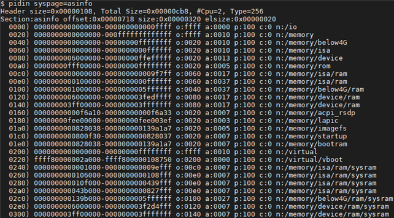

# QNX IO

CPU如何访问硬件设备以及交互



硬件设备可以占有内存地址,I/O端口, DMA(Direct Memory Access直接存储访问)以及中断口



系统总线是指CPU，主存，I/O设备各大部件之间的信息传输线,并且按传输的信息不同,又可以分为:

* 数据总线
* 地址总线
* 控制总线


## Memory Mapping 内存映射

### 原理



虚拟地址即逻辑地址,实际并不存在, 最终需要映射到物理地址(MMU地址转换)

由于所有用户进程总的虚拟地址空间比可用的物理内存大很多，因此只有最常用的部分才与物理页帧关联。

其实真正的内存映射是将逻辑内存映射到磁盘上的文件这一过程;而逻辑地址到物理地址的转化是由MMU单元完成.


用户进程在读取磁盘文件内容时,其实是先将磁盘要读取的文件读取到物理内存里内核空间,然后再拷贝到物理内存中的用户空间, 需要2次数据拷贝.



若使用内存映射的话,只需要1次数据拷贝.



### API

```c
void *mmap_device_memory(void *virtual_addr,size_t len,int prot,int flags,uint64_t physical_addr);
```
返回虚拟地址指针

* virtual_addr 请求的进程空间里虚拟地址起始位置
* len 映射空间的大小 需要page大小的整数倍
* port 访问flags
  * PROT_READ
  * PROT_WRITE
  * PROT_NOCACHE
* flags 映射flags
* physical_addr 线性物理地址

```c
ptr=mmap_device_memory(0,0x4000,PROT_READ|PROT_WRITE|PROT_NOCACHE,0,0xa0000);
```


## Port I/O 输入输出接口

```c
// enable I/O privilege for current thread
ThreadCtl(_NTO_TCTL_IO,NULL);
// get access to a devices registers
iobase = mmap_device_io(len,base_port);
//read an 8 bit value
val8 = in8(iobase+N);
// write an 8 bit value
out8(iobase+N,val8);
```

`mmap_device_io`内部其实也是内存映射,将逻辑地址直接映射到I/O设备(I/O设备被挂载为文件)

```c
uintptr_t mmap_device_io(size_t len,uint64_t io){
#if defined(__X86__)
  return io;
#else
 return (uintptr_t)mmap64(0,len,PORT_NOCACHE|PROT_READ|PROT_WRITE,MAP_SHARED|MAP_PHYS,NOFD,io);
#endif
}
```

## DMA

一般实际场景比简单的内存映射和IO口映射要复杂的多, 且出于性能考虑,DMA(Direct Memory Access) 参与外设与内存之间数据传输是常规现象.

使用DMA 可以有以下两点好处:

* 申请分配的物理空间可以是连续的　`mmap()`  中的flags参数为: MAP_ANON|MAP_PHYS|MAP_PRIVATE
* DMA来负责数据传输和地址转换



## Typed Memory

POSIX typed memory provides an interface to open memory objects (which are defined in an OS-specific fashion) and perform mapping operations on them. It's useful in providing an abstraction between BSP- or board-specific address layouts and device drivers or user code. 
系统层级定义的一些内存区域.

系统 typed memory一个配置例子:



`pidin syspage=asinfo` 能显示当前系统命名的typed memory:


这些命名的内存区域都是在系统启动时通过如下API创建的:
```c
as_add(paddr_t start,paddr_t end,unsigned attr,const char* name,unsigned owner);
```


Sample

* [sample1_typed_memory.c](../code/qnxio/sample1_typed_memory.c)

## Cache Control

API包含如下:

|API name|API desc|
|--|--|
|cache_init()|初始化|
|cache_finit()|释放|
|cache_flush()|flush关联的数据缓冲区|
|cache_inval()|将关联的数据缓冲区标志为失效|


## PCI

## Timing Loops

当一些操作需要延迟等待一些时间后再操作时, QNX提供`nanospin*()` spin loop函数

如何使用`nanospin*()`

1. calibrate 校正 `nanospin_calibrate(int disable)`
2. 设置延迟时间 `nanospin(struct timespec *duration)` `nanospin_ns(unsigned long nsec)`

其中第二步也可以设置loop循环次数:
```
unsigned nanospin_ns_to_count(unsigned nsec);
nanospin_count(unsigned count);
```
QNX 提供CPU时钟运行计数函数:

```c
uint64_t count;
count = ClockCycles();
```
每过一个`cycles_per_sec`时钟周期, `CloclCycles()`都会累加1. 譬如CPU频率为500MHZ的 时钟周期为 2纳秒; 频率为2GHZ的时钟周期为 0.5纳秒

```c
#include <sys/syspage.h>
uint64_t cycles_per_sec;
cycles_per_sec = SYSPAGE_ENTRY(qtime)->cycles_per_sec;
```

当有硬件支持`CloclCycles()`时:
* 精确将非常高
* 不用通过中断拿到结果

例子:
```c
void nanospin_clock(unsigned nsec){
 uint64_t cps, clock_start, clock_cur, clock_end;
 clock_start = ClockCycles();
 cps =  SYSPAGE_ENTRY(qtime)->cycles_per_sec;
 clock_end = clock_start + (nsec*cps)/(1000*1000*1000)
 while(1){
  clock_cur = ClockCycles();
  if(clock_cur > clock_end)
    return;
 }
}
```


## 参考

[计算机系统总线](https://blog.csdn.net/Baniel01/article/details/53079032)

[内存映射的原理](https://www.cnblogs.com/still-smile/p/12155181.html)