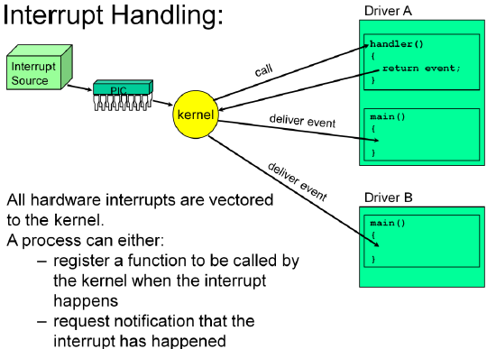
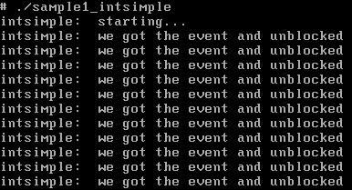

# QNX Interrupt

## 基础概念

CPU中断技术的定义如下:

*  计算机处于执行期间
*  系统内发生了非寻常或非预期的急需处理事件
*  CPU暂时中断当前正在执行的程序而转去执行相应的事件处理程序
*  处理完毕后返回原来被中断处继续执行

中断的优点:

* 可以使CPU和外设同时工作，使系统可以及时地响应外部事件
* 可允许多个外设同时工作，大大提高了CPU的利用率，也提高了数据输入、输出的速度
* 可以使CPU及时处理各种软硬件故障

CPU中断按中断源分为两大类

* 硬件中断 - 外部中断
  * 可屏蔽中断
    * 由计算机的外设或一些接口功能产生，如键盘、打印机、串行口等
    * 可以在CPU要处理其它紧急操作时，被软件屏蔽或忽略
  * 非屏蔽中断
    * 由意外事件导致，如电源断电、内存校验错误等
    * 无法通过软件进行屏蔽，CPU必须无条件响应
* 软件中断 - 内部中断 在程序中调用INTR中断指令引起的中断

在x86架构的处理器中，CPU的中断控制器由两根引脚(INTR和NMI)接收外部中断请求信号。其中：

1. INTR接收可屏蔽中断请求
2. NMI接收非屏蔽中断请求

中断处理



其中中断有优先级,导致中断处理也具备了优先级. 
* 高优先级的中断优先处理, 在中断处理的过程遇到更高优先级的中断,当前中断处理暂停,进行更高优先级中断的处理. 
* 相同优先级的中断,按先后顺序依次处理
* 中断的优先级天然高于线程(thread)的优先级

### API

```c

id = InterruptAttach(int intr,
                    struct sigevent *(*handler)(void *,int),
                    void *area, int size,unsigned flags);

id = InterruptAttachEvent(int intr,struct sigevent *event,unsigned flags);

InterruptDetach(int id);
InterruptWait(int flags, uint64_t *reserved);
InterruptMask(int intr,int id);
InterruptUnMask(int intr,int id);

InterruptLock(struct intrspin *spinlock);
InterruptUnlock(struct intrspin *spinlock);
```

使用这些QNX API前需要获得I/O的权限  `ThreadCtl(_NTO_TCTL_IO,0)`

sample code:

```c
struct sigevent event;

main(){
  ThreadCtl(_NTO_TCTL_IO,0);
  SIGEV_INTR_INIT(&event);
  id = InterruptAttachEvent(INTNUM,&event,...);
  for(;;){
    InterruptWait(0,NULL);
    // do the interrupt work here, at thread priority
    InterruptUnmask(INTNUM,id);
  }
}
```

```c
// to associate an event with an interrupt vector
id = InterruptAttachEvent(intr, event, flags);
```

* intr  - logical interrupt vector number
* event - tells the kernel how to wake up a thread
* flags - additional information flags


```c
// to associate a handler with an interrupt vector
id = InterruptAttach(intr,handler,area,size,flags);
```

* handler  - handler address
* area - passed to your handler
* size - size of area

Logical interrupt vector numbers - 逻辑中断向量

* 在启动时被定义
* 会写在板子的buildfile文件中 ($QNX_TARGET/cpu/boot/build)

## 通知方法

* SIGEV_INTR/InterruptWait()
  * 最简单也最快速
  * 必须在一个线程里
  * 队列里元素只有有1个
* Pulse
  * 可以在多线程下等待接收channel上的消息
  * 可以队列化
  * 最灵活
* Signal
  * 如果使用signal handler,那将是开销最大的方案
  * 可以队列化

### InterruptWait

等待中断发生最简单的方法是:

```
InterruptWait(reserved,reserved);
```

NOTE: 等待的线程必须和附加handler的线程是同一个


### Pulse

```c
#define INTR_PULSE _PULSE_CODE_MINAVAIL
struct sigevent event;

const struct sigevent* handler(void *area,int id){
  // do work
  return (&event); // wake up main thread
}

int main(){
  chid = ChannelCreate(0);
  coid = ConnectAttach(ND_LOCAL_NODE,0,chid,_NTO_SIDE_CHANNEL,0);
  SIGEV_PULSE_INIT(&event,coid,MyPriority,INTR_PULSE,0);
  InterruptAttach(intnum, handler,NULL,0,_NTO_INTR_FLAGS_TRK_MSK);
  for(;;){
    rcvid = MsgReceive(chid,...);
    if(rcvid == -){
      // got a pulse
    }
  }
  return 0;
}
```
### Sample

* [sapmel1_intsimple.c](../code/qnxinterrupt/sample1_intsimple.c)



NOTE: 需要以root权限运行
