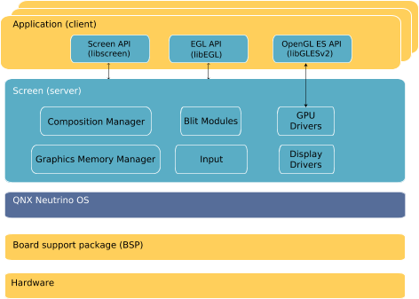
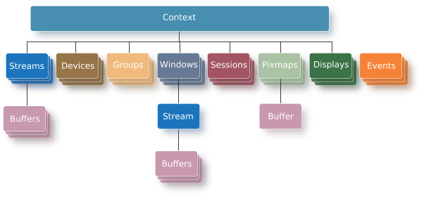

# QNX Screen

## Screen architecture

Screen图形子系统是基于客户端/服务端模式. Application作为客户端向服务端Screen请求图形服务.
另外,图形子系统提供的服务中还包含窗体混合服务,使得所有的App界面的渲染在buffer缓冲区里,稍后才被真正的更新输出显示.

Screen主要被设计用于软件渲染,但也支持硬件加速渲染和硬件加速混合.

## Screen API

### Context
所有的Screen API组件都需要关联一个Context.
Context,Screen上下文提供了关于图形操作的设置.
简单来说,Context在Screen和App之间建立了一个Connection连接通道.通过这个连接, App可以和Screen进行通讯.
之前提到Screen图形子系统是基于client/server模式的, app作为客户端需要和服务端server进行交互,需要首先建立一个通道, 这里Context就是一个通道一个连接.

### Device
可以和display联动的输入设备,比如键盘,鼠标,摇杆,和触控板.

### Display
显示设备,普通屏幕,触摸屏等.

### Window
window表示一个可以作画的平面,它的内容用于显示.window的类型分为应用window,子window,嵌入window.

### Group
Group用来管理组织多个window;一般父window创建一个group, 然后子window就可以加入该group, 子window会自动继承父window的属性

### Pixmap
Pixmap代表了一个非屏幕上的显示区域内容, 这些内容只有当拷贝到window的buffer时才会显示可见.

### Stream
Stream允许图形的内容可以被其他组件生产和消费.组件之间可以通过stream进行信息流转.

### Buffer
Buffer是内存中一块存储像素内容的区域, 它可以在Context建立后被创建,但只有被附加到window,pixmap或stream时,才能被使用.
pixmap只能附加一个buffer, 而window和stream可以附加多个buffer

### Session
An input session allows applications to control how raw events are processed into higher-level events. A session allows your application to capture events that are specific to a certain region, device, or Screen event type; it provides you more control over the dispatching of input events than can be achieved through windows alone

### Event
Event包含window的创建事件,属性设置事件,按键事件,触摸事件等.
每个Context都关联一个事件队列event queue. 另外, event可以独立于Context存在.