# QNX Screen Resource Sharing

显示资源共享允许在同一个应用和进程中或者多个应用和进程之间访问buffer以及内容.

## Sharing buffers (Cloning)

简单说, 就是复制buffer区域里的内容.

复制可以提高应用性能

* 只需要更新的共享buffer
* 混合显示区域数量能减少

### Windows

窗体之间共享buffer

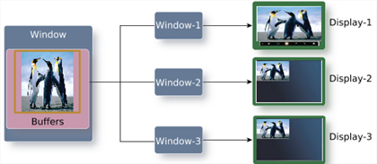

```c
// win - The handle of the window that's sharing the buffer(s) owned by another window. 
// share - The handle of the window whose buffer(s) is to be displayed.
int screen_share_window_buffers(screen_window_t win,screen_window_t share)
```

另外需要注意的是, 当被共享的窗体A具有子窗体C时, 子窗体的buffer是不会被共享的
若需要在共享的窗体B中显示窗体A及C的内容, 可以通过获取窗体A的截屏来达到

```c
/**
*win
*    The handle of the window that is the target of the screenshot. 
*buf
*    The buffer where the pixel data is copied to. 
*count
*    The number of rectangles supplied in the save_rects argument. 
*save_rects
*    A pointer to (count * 4) integers that define the areas of the window that need to be grabbed for the screenshot. 
*flags
*    For future use. Pass 0 for now. 
*/
int screen_read_window(screen_window_t win,
                       screen_buffer_t buf,
                       int count,
                       const int *save_rects,
                       int flags)
```


### Streams

窗体与Stream之间共享buffer

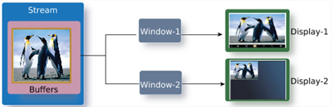

```c
/**
* win - The handle of the window that is sharing the buffer(s) owned by another stream. 
* share - The handle of the stream whose buffer(s) is or are to be displayed.
*/
int screen_share_stream_buffers(screen_window_t win,
                                screen_stream_t share)
```

需要注意的是Screen不允许共享那些已经被消费的buffers

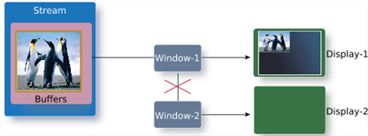

### Displays

窗体与Display之间共享buffer


```c
// win - The handle of the window that the display is sharing its buffer(s) with. 
// share - The handle of the display who is sharing its buffer(s) with the specified window. 
// count - The number of buffers that is shared by the display and the window. Use a count of 0 to ensure that the number of buffers shared by the window matches that of the display.
int screen_share_display_buffers(screen_window_t win,
                                 screen_display_t share,
                                 int count)
```

### Sample

* [screenshot_sample.cpp](../code/qnxscreen/src/screenshot_sample.cpp)

Step to run:

* 启动虚拟机 VMware of QNX_SDP-x86_64
* 启动screen `./etc/graphics-startup.sh`
* 在Momentics上连接到虚拟机, 并且编译运行
* 虚拟机screen界面变化, 截屏已保存

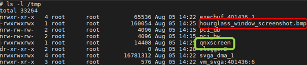

## Consuming buffers (Using Streams)

Stream(流) 是off-screen和多缓冲的渲染目标.

Stream的生产消费buffer流程可以描述如下:

1. 初始化生产者和消费者的Stream; 生产者的Stream创建相关buffer, 消费者的Stream不需要创建buffer,只需共享生产者的Stream的buffer
   
   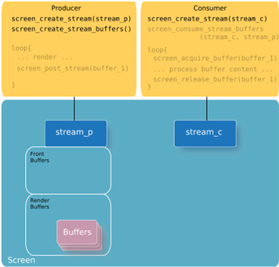

2. 生产者的Stream开始渲染内容到它的可用的渲染buffer; 消费者要确保调用`screen_consume_stream_buffers()` 来关联消费者的Stream和生产者的Stream
    
    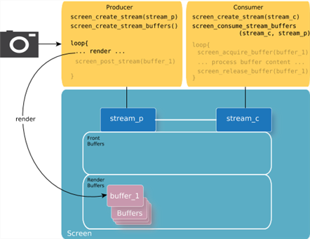

3. 一旦生产者渲染内容已经准备好了,发布buffer将会使得其从render buffer移到 front buffer, 在front buffer中的buffer可以被消费者使用
    
    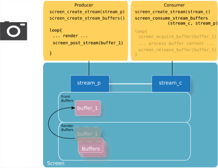

4. 消费者开始使用front buffer前,需要给生产者的front buffer加锁,防止未使用结束, front buffer被生产者Stream放回到render buffer

    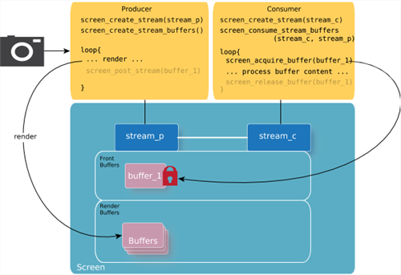

5. 消费者完成访问生产者的buffer后,需要释放该buffer,这样生产者就可以再次更新该buffer

    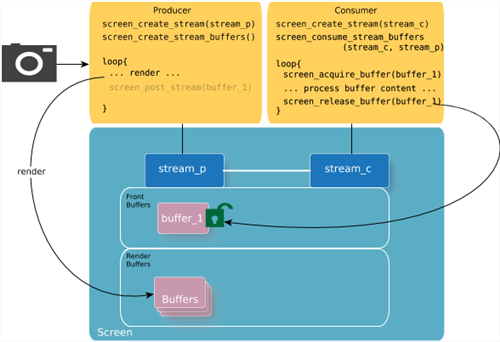

6. 释放完生产者的buffer, 该buffer就再次回到 render buffers里

    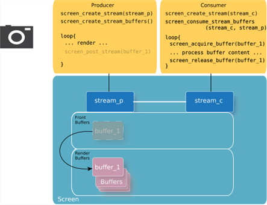

### Producer

* 创建生产者的Stream
```c
// ...
screen_context_t screen_pctx;
screen_create_context(&screen_pctx, SCREEN_APPLICATION_CONTEXT);
// ...
/* Create the producer's stream */
screen_stream_t stream_p;
screen_create_stream(&stream_p, screen_pctx);
// ...
```

* 设置相应的属性
```c
// ...
int buffer_size[2] = {720, 720};
screen_set_stream_property_iv(stream_p, SCREEN_PROPERTY_BUFFER_SIZE, buffer_size);
screen_set_stream_property_iv(stream_p, SCREEN_PROPERTY_FORMAT, (const int[]){ SCREEN_FORMAT_RGBX8888 });
screen_set_stream_property_iv(stream_p, SCREEN_PROPERTY_USAGE, (const int[]){ SCREEN_USAGE_OPENGL_ES1 | SCREEN_USAGE_WRITE | SCREEN_USAGE_NATIVE });
```

* 创建Stream的buffer
```c
// ...
screen_create_stream_buffers(stream_p, 2);
// ...
```

* 授权给消费者允许接收生产者的事件以及访问生产者Stream的buffers
```c
// ...
int permissions;
screen_get_stream_property_iv(stream_p, SCREEN_PROPERTY_PERMISSIONS, &permissions);
/* Allow processes in the same group to access the stream */
permissions |= SCREEN_PERMISSION_IRGRP;
screen_set_stream_property_iv(stream_p, SCREEN_PROPERTY_PERMISSIONS, &permissions);
// ...
```
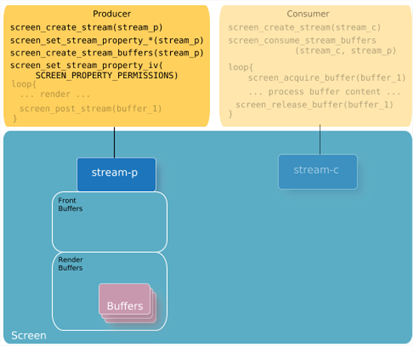

* 渲染内容并发布
  
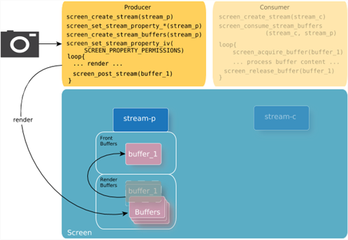

### Consumer

* 创建消费的Stream
```c
// ...
screen_context_t screen_cctx;
screen_create_context(&screen_cctx, SCREEN_APPLICATION_CONTEXT);
// ...
/* Create the consumer's stream */
screen_stream_t stream_c;
screen_create_stream(&stream_c, screen_cctx);
// ...
```

* 获取生产者的Stream
```c
// ...
screen_event_t event;
int stream_p_id = -1;
screen_stream_t stream_p = NULL;
screen_buffer_t acquired_buffer;                /* Buffer that's been acquired from a stream */

/* Create an event so that you can retrieve an event from Screen. */
screen_create_event(&event);
while (1) {
    int event_type = SCREEN_EVENT_NONE;
    int object_type;
    
    /* Get event from Screen for the consumer's context. */
    screen_get_event(screen_cctx, event, -1);
    
    /* Get the type of event from the event retrieved. */
    screen_get_event_property_iv(event, SCREEN_PROPERTY_TYPE, &event_type);
    
    /* Process the event if it's a SCREEN_EVENT_CREATE event. */
    if (event_type == SCREEN_EVENT_CREATE) {
            /* Determine that this event is due to a producer stream granting permissions. */
            screen_get_event_property_iv(event, SCREEN_PROPERTY_OBJECT_TYPE, &object_type);
            
            if (object_type == SCREEN_OBJECT_TYPE_STREAM) {
            
                /* Get the handle for the producer's stream from the event. */
                screen_get_event_property_pv(event, SCREEN_PROPERTY_STREAM, (void **)&stream_p);
                
                if (stream_p != NULL) {
                    /* Get the handle for the producer's stream ID from the event.
                     * If there are multiple producers in the system, consumers can use the producer's stream ID
                     * as a way to verify whether the SCREEN_EVENT_CREATE event is from the producer that the consumer
                     * is expecting. In this example, we assume there's only one producer in the system.
                     */
                    screen_get_stream_property_iv(stream_p, SCREEN_PROPERTY_ID, &stream_p_id);
                    // ...
                }
            }
        }
        if (event_type == SCREEN_EVENT_CLOSE) {
            /* Determine that this event is due to a producer stream denying permissions. */
            screen_get_event_property_iv(event, SCREEN_PROPERTY_OBJECT_TYPE, &object_type);
            
            if (object_type == SCREEN_OBJECT_TYPE_STREAM) {
            
                /* Get the handle for the producer's stream from the event. */
                screen_get_event_property_pv(event, SCREEN_PROPERTY_STREAM, (void **)&stream_p);
                
                if (stream_p != NULL) {
                    /* Get the handle for the producer's stream ID from the event.
                     * If there are multiple producers in the system, consumers can use the producer's stream ID
                     * as a way to verify whether the SCREEN_EVENT_CREATE event is from the producer that the consumer
                     * is expecting. In this example, we assume there's only one producer in the system.
                     */
                    screen_get_stream_property_iv(stream_p, SCREEN_PROPERTY_ID, &stream_p_id);
                    // ...
                    /* Release any buffers that have been acquired. */
                    screen_release_buffer(acquired_buffer);
                    // ...
                    /* Deregister asynchronous notifications of updates, if necessary. */
                    screen_notify(screen_cctx, SCREEN_NOTIFY_UPDATE, stream_p, NULL);
                    // ...
                    /* Destroy the consumer stream that's connected to this producer stream. */
                    screen_destroy_stream(stream_c);
                    // ...
                    /* Free up any resources that were locally allocated to track this stream. */
                    screen_destroy_stream(stream_p);
                    // ...
                }
            }
        }
        // ...
}
screen_destroy_event(event);
// ...
```

* 建立消费Stream和生产Stream间的连接
```c
// ...
screen_consume_stream_buffers(stream_c, 0, stream_p);
// ...
```

* 获取生产者的front buffer
```c
screen_buffer_t acquired_buffer; 
// ...
while (1) {
    screen acquire_buffer(&acquired_buffer, stream_c, NULL, NULL, NULL, 0);
    // ...
}
```

* 处理内容
* 释放buffer
```c
// ...
screen_release_buffer(acquired_buffer);
// ...
```