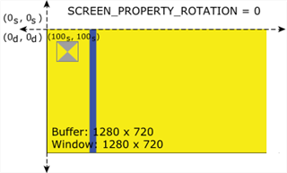

# QNX Screen Windowing

窗口用来显示内容以及从不同的源产生的合成内容

## Window Groups

窗体组建立了一系列窗口的父级关系.


在以下情况下需要用到窗体组:

* 你要显示的内容是堆叠在另外一个窗体上的
* 父窗体没有自己的buffer,但其子窗体拥有buffer
* 你不能在一个窗体上做任何事,最好不同的渲染源渲染到单独的窗体


窗体树形结构是通过窗体组建立的, 而窗体组其实是以属性 `SCREEN_PROPERTY_ID` 标识的,其值是字符串.


```c
char window_group_name[64];
// 获取窗体组 组名
screen_get_window_property_cv(screen_window, SCREEN_PROPERTY_ID, sizeof(window_group_name), window_group_name );
// 子窗体加入父窗体
screen_join_window_group(screen_child_window, window_group_name);
```

## Window Geometry

窗体的几何属性包含了关于窗体以及内容如下显示的一系列的属性. 


#### 窗体的类型

* SCREEN_APPLICATION_WINDOW 主要的窗体,可以作为父窗体, 没有父窗体依然可见
* SCREEN_CHILD_WINDOW 子窗体,具有父级窗体, 未附加到父窗体时不可见
* SCREEN_EMBEDDED_WINDOW 内嵌窗体,具有父级窗体, 未附加到父窗体时不可见
* SCREEN_ROOT_WINDOW 能够消费所有在其组内窗体的内容, Screen的合成操作可以作用在此

### 窗体属性

窗体属性有两套坐标体系相关的属性.

#### 显示属性

这类属性是有关如何显示的. 这些属性都是相对与当前显示坐标系.


|窗体属性|描述|
|---|---|
|SCREEN_PROPERTY_CLIP_POSITION|剪裁区的x,y像素坐标值|
|SCREEN_PROPERTY_CLIP_SIZE|剪裁区的大小|
|SCREEN_PROPERTY_GLOBAL_ALPHA|透明度|
|SCREEN_PROPERTY_POSITION|窗体x,y像素坐标值|
|SCREEN_PROPERTY_SIZE|窗体大小|
|SCREEN_PROPERTY_VISIBLE|可见不可见|
|SCREEN_PROPERTY_ZORDER|z-index|

#### 内容属性

这类属性是基于内容buffer的坐标系.


|窗体属性|描述|
|---|---|
|SCREEN_PROPERTY_ALPHA_MODE|The indicator of how the alpha channel should be interpreted|
|SCREEN_PROPERTY_BRIGHTNESS|The brightness adjustment of a window, defined as an integer in the range of [-255..255]|
|SCREEN_PROPERTY_COLOR_SPACE|Specifies the color organization of your buffer|
|SCREEN_PROPERTY_CONTRAST|The contrast adjustment of a window, defined as an integer in the range of [-128..127]|
|SCREEN_PROPERTY_FLIP|The indicator to flip the contents of the window|
|SCREEN_PROPERTY_HUE|The hue adjustment of a window, defined as an integer in the range of [-128..127]|
|SCREEN_PROPERTY_MIRROR|The indicator to whether the contents of the window are mirrored (flipped horizontally)|
|SCREEN_PROPERTY_PROTECTION_ENABLED|Indicates whether authentication is to be requested before the content of your window can be displayed. Authentication is requested when the window is posted and its SCREEN_PROPERTY_VISIBLE property indicates that the window is visible|
|SCREEN_PROPERTY_ROTATION|The current rotation, in degrees, of the window's content|
|SCREEN_PROPERTY_SATURATION|The saturation adjustment of a window, defined as an integer in the range of [-128..127]|
|SCREEN_PROPERTY_SOURCE_CLIP_POSITION|clip区域位置|
|SCREEN_PROPERTY_SOURCE_CLIP_SIZE|clip区域大小|
|SCREEN_PROPERTY_SOURCE_POSITION|位置|
|SCREEN_PROPERTY_SOURCE_SIZE|大小|
|SCREEN_PROPERTY_TRANSPARENCY|The way that the alpha channel of your window is used to combine your window with other windows or the background color underneath|

### 窗体旋转


从图上可以看出窗体旋转实际上是针对于source内容的.
简单的理解为, 窗体实际显示区域坐标不变动, 而显示区域的内容buffer坐标系回旋转, 之后再拉伸以适应窗体显示区域

类似,子窗体的旋转也一样的过程.




## Window Management

窗体管理器及父窗体都具有管理其它窗体的能力, 包括处理从应用和子窗体的事件

N/A

## Tutorials

### 创建窗体

```c
// 创建相关变量, context, window
screen_context_t   screen_context = 0;
screen_window_t    screen_window = 0;
char               window_group_name[64];
```

```c
// 创建context
screen_create_context(&screen_context, SCREEN_APPLICATION_CONTEXT);
```

```c
// 创建窗体
screen_create_window(&screen_window, screen_context);
```

```c
// 获取window id即group名字
screen_get_window_property_cv(screen_window,SCREEN_PROPERTY_ID,sizeof(window_group_name),window_group_name);
```

```c
// 设置窗体的属性
int format = SCREEN_FORMAT_RGBA8888;
screen_set_window_property_iv(screen_window, SCREEN_PROPERTY_FORMAT, &format);

int usage = SCREEN_USAGE_NATIVE;
screen_set_window_property_iv(screen_window, SCREEN_PROPERTY_USAGE, &usage);
```

```c
// 创建窗体的buffer
screen_create_window_buffers(screen_window, 1);
```


```c
// 销毁窗体及context
screen_destroy_window(screen_window);
screen_destroy_context(screen_context);
```

### 创建子窗体

```c
// 创建相关变量, context, window
screen_context_t    screen_context = 0;
screen_window_t     screen_child_window = 0;
```

```c
// 创建context
screen_create_context(&screen_context, SCREEN_APPLICATION_CONTEXT);
```

```c
// 创建子窗体
int wintype = SCREEN_CHILD_WINDOW;
screen_create_window_type(&screen_child_window, screen_context, wintype );
```

```c
// 加入父窗体
screen_join_window_group(screen_child_window, window_group_name);
```